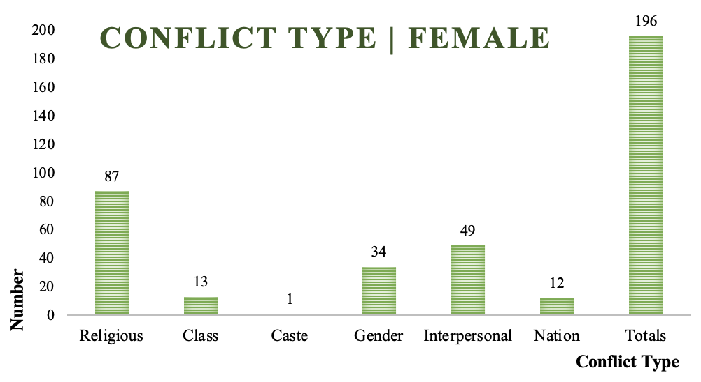
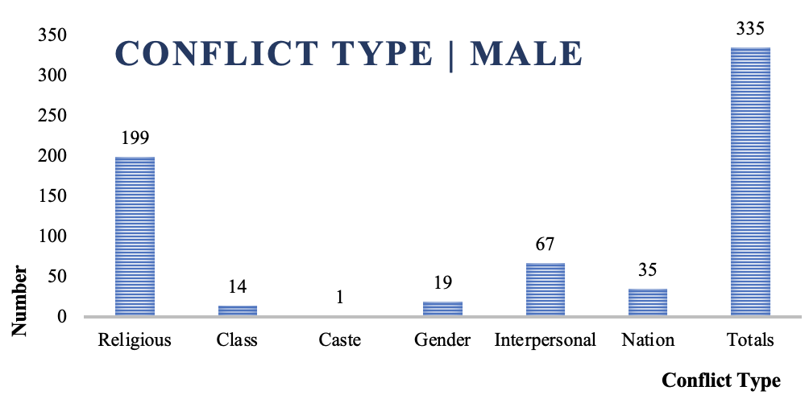
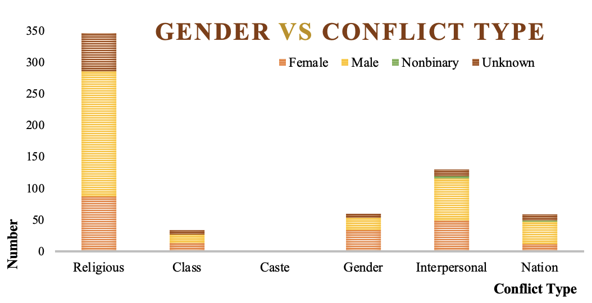
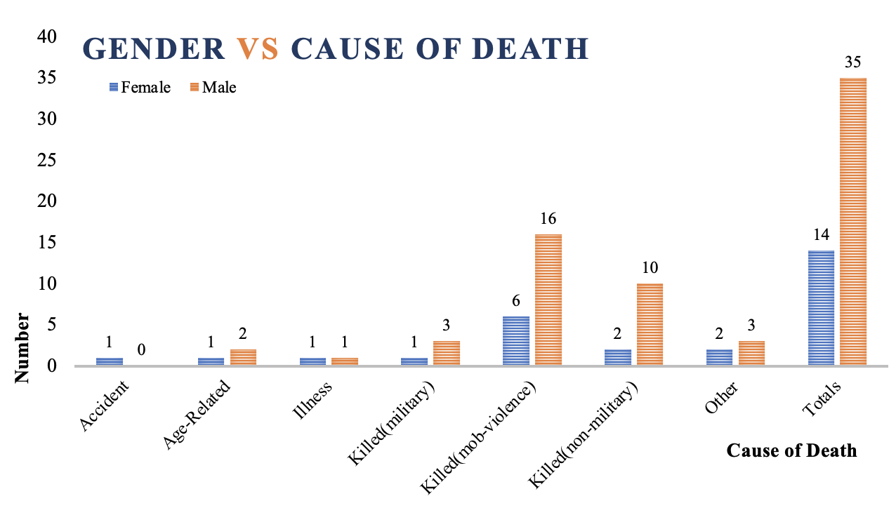

```{r setup, include=FALSE}
knitr::opts_chunk$set(echo = TRUE)
```

# Research Question

### *How does gender influence the forms of conflict a person engages in?*

Our question aims to study how the gender of a character impacts the conflict a person engages in. We take conflict to include forms of violence, making the cause of death also a feature to study. We are exploring conflict from being an active participant/initiator through the medium of the forms of conflict, and also through being a victim of it - in the forms of death. First, this question will **help answer if there is a difference in the forms of conflict men and women participated in during Partition.** Second, it should help **establish the differences in the forms of violence they are subjected to**. This question can help understand the reasons for variations in conflict engagement.

#### Specific Queries

1. We used the facet builder, focusing on events, to search for the gender of characters associated with different kinds of conflict. Thus, it recorded the gender of characters mentioned during conflict events. This allowed us to observe patterns in participation, and allowed us to assess if certain types of conflict saw more participation from men or women.

2. We created a crosstab under characters to record the causes of deaths according to gender to assess if certain forms of violence were associated more with a certain gender.

# Crosstab

#### 1. Conflict type and gendered participation:
&nbsp;


&nbsp;

#### 2. Cause of death and gender:
&nbsp;


# Analysis
&nbsp;

#### *a) Conflict type and gendered participation*
&nbsp;

<center>



*As the graph shows, 44.4% of the conflicts women engage in are religious, and the lowest conflict type is Caste with 0.5%. The total number of conflicts are 196, almost half of them men.*

</center>

&nbsp;

<center>



*As the graph shows, 59.4% of the conflicts men engage in are religious, and the lowest conflict type is Caste with 0.2%. The total number of conflicts are 335, significantly more than women.*

</center>

&nbsp;

Our data reveals that there is a **larger number of men participating in conflict**, however this is expected given the greater number of male characters in the stories. We chose to focus on patterns and differences emerging from the same.

The **number of men and women participating in religious conflicts as a proportion of their respective totals is not very different and represents the majority of conflict cases.** This tells us that partition violence was primarily driven by religion, and involved both men and women inadvertently. However, a variation comes about in the proportion of women who were involved in class-based and gender-based violence: 17.34% and 13.5% of women who participated in conflicts participated in gender and class based conflict, respectively, while this number stands at 5.6% and 4.17% for men.

For gender-based violence, the primary reason could be that women were on the receiving end of such violence, which led to them being mentioned during these events more frequently. However, class-based conflict stands out -- a comparatively greater number of mentions of women (9% more men as a proportion of their totals) around the same could be because of the differences in the way class status is ascribed to men and women and the consequences of the same. The power imbalances arising from especially lower economic statuses women were in, could be another reason increasing their mentions during conflicts.

One feature that stands out and corroborates other existing information about partition, is that the unknown category which included mobs, had a disproportionately high number of conflicts ascribed to religion (63%) versus other categories. This indicates that mobs were primarily driven by religion, and were religiously homogeneous. While other forms of conflict such as gender or nation-based conflict were relevant, this was nowhere close to the violence sparked by religion.

<center>



</center>

&nbsp;

#### *b) Cause of Death and Gender*

&nbsp;

<center>



*As seen above, more male deaths occured in all, but within that, mob-violence is the most populated cause of death among both men and women, followed by non-military killings*

</center>

&nbsp;

When it comes to studying the cause of death, **mob violence is the largest contributor to deaths**, and the number of men and women killed by the same, as a proportion of their totals, is not particularly different. However, the reasons for these deaths could differ. Perhaps, the reason for women’s deaths at the hands of mob violence was a product of both religious and gendered conflict, as they were frequent victims of sexual violence too.

For the cases of non military deaths, however, the proportion of men killed vs the proportion of women is considerably different, with the deaths for men being nearly double those of women. This could be a factor of just having a greater number of men in our dataset, but it could also be because in several stories the primary character is male, and we thus understand the story through his lens. We explore his interactions with men more frequently and the women in such contexts are primarily background characters - violence against them is referred to, but our primary frame of reference remains the man. Along with this, given the larger number of men to be found in public spaces vs women, it is likely that these deaths would be higher.

# Reflection

Heurist (or databases in general) provides some solutions that Voyant and R could not. Primarily, **relationships between different entities can be established**, and these relationships **can be accessed** with search queries. Further, it allows for picking apart the text into specific entities and using them to ask more granular questions. Although manual entry of the data in itself is time consuming, it also **helps with a closer reading of the texts** involved. Additionally, it is relatively **easier to categorise texts into major segments** like characters, relationships between the various characters, and the different events. Using Voyant and R, it was difficult to delineate the texts like this. It is very hard for a program to figure out when one event ends and another begins.

One of the limitations of this particular database is that it had **too few data points for characters of genders other than Male**. While this in itself could be an insight, it certainly skews the results. Non-binary characters and characters of unknown genders are so few that they didn’t even merit analysis, as there was too little to compare.

Another limitation is that when looking at the *conflict types*, it is **difficult to determine which character is the instigator, and which is the victim**. The events provide information on what kind of conflict it is and the characters involved, but not the agency of the characters with respect to the conflict. Having this information could further nuance our analysis, letting us see the proportions of different genders instigating the conflicts and being victimized by it. Having access to character traits (their predispositions, violent or non-violent tendencies, whether they were religiously vocal) could have allowed us to explore if being involved in a conflict was in any way related to their traits, and if so then which.

It was especially **tricky to obtain data of different fields** from two different entities. We could only look at numbers from one entity. The method with which we extracted the information was counterintuitive. Database entry defeats the point of automating the breakdown of a text, but it **helps organize it into analysable pieces**. Each piece itself is rich with data and once finished, we have a huge database of organized data, easy to sort, manipulate and extract.

Last, this project raised questions about the mechanism of analysing several texts, without necessarily having an in-depth knowledge of them. We were **not aware of the context within which several of our data points occurred**, and instead, analysing literature from this macro lens brought its own challenges and advantages. By its very nature, we could not answer broader questions, but had to restrict ourselves to questions that could be directly answered by the dataset. Thus, there can be concerns with the **extent to which one can draw more abstract conclusions from the data**, however, it allows for a broad overview of several texts revolving around a theme, which in all proved useful.